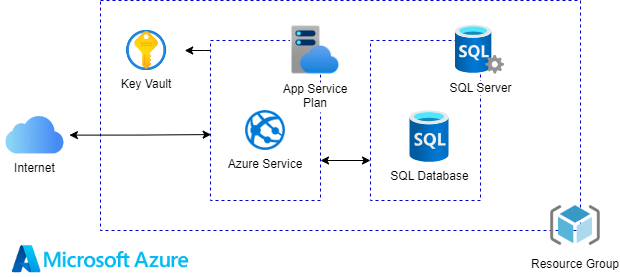
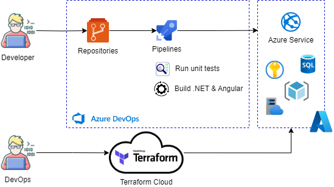
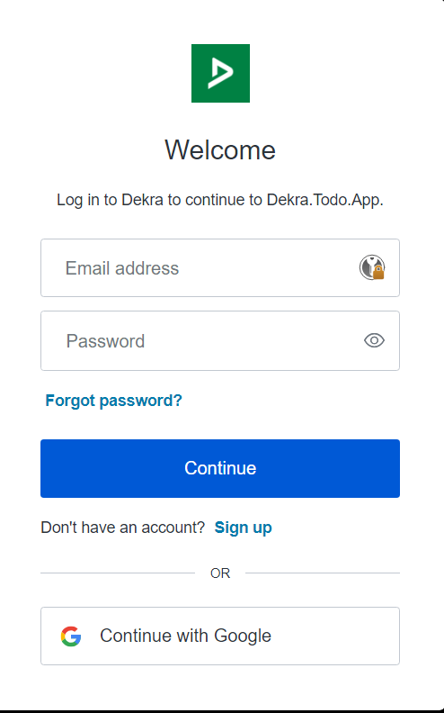
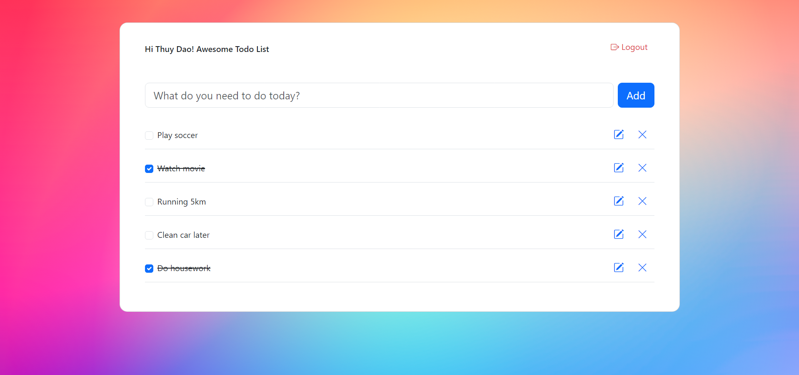
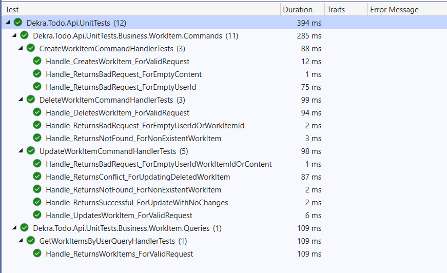

# Introduction

This project is a simple todo web application which is hosting at https://james-todo.azurewebsites.net, applying some technologies below:
- [Angular 17](https://blog.angular.io/introducing-angular-v17-4d7033312e4b)
- [.NET 8](https://learn.microsoft.com/en-us/dotnet/core/whats-new/dotnet-8/overview)
- [Terraform](https://www.terraform.io)
- [Auth0](https://auth0.com) for authentication
- [Azure pipelines](https://azure.microsoft.com/en-us/products/devops/pipelines) support CI/CD
- Azure resources
    - [Azure App Service](https://azure.microsoft.com/en-us/products/app-service)
    - [Azure SQL Database](https://azure.microsoft.com/en-us/products/azure-sql/database)
    - [Azure Key Vault](https://azure.microsoft.com/en-us/products/key-vault)

## Features:
- [x] Register using personnel email
- [x] Login using Username-Password-Authentication or Google-Authentication
- [x] Create/Update/Delete work items
- [x] Mark as done work item

## Inside technologies

- Frontend:
    - Angular Framework 17
    - Bootstrap
    - Bootstrap Icons
    - rxjs/state & rxjs/effects
- Backend:
    - .NET 8 LTS
    - Entity Framework, Code First
    - Design patterns: UnitOfWork, Repository, Factory, CQRS, Mediator
    - Microsoft SQL Server

## Infrastructure


- [x] All resources located in the same resource group and the same location
- [x] The SQL Server needs to set firewall rules and not open for public access
- [x] All secret values used in WebApp need to be defined in IaC and not manually setup
- [x] Key Vault needs to set access policies
- [x] All resources and config need to be defined in IaC and don't need manual configuration
- [ ] The database connection string needs to set RBAC for each login user

## CI/CD flows



# Setup infrastructure
Base on your requirements and project requirements, please follow this [link](https://developer.hashicorp.com/terraform/tutorials/azure-get-started) to setup and manage your infrastructure state.


# Awesome's Todo - .NET 8 & Angular 17

## 1. Project Structure

The project structure is designed to promote separation of concerns and modularity, making it easier to understand, test, and maintain the application.

```
├── Dekra.Todo.Api
│   ├── Data                    # Contains contracts, entities, migrations, etc.
│   ├── Business                # Contains business logic
│   ├── Infrastructure          # Contains configurations, middlewares, authentication, extensions, etc.
│   └── Controllers             # Contains REST API endpoints
└── Dekra.Todo.App
    ├── helpers                 # Contains guards, interceptors ....
    ├── components              # Contains application components, modules
    ├── models                  # Contains data models
    ├── store                   # Contains logic to manage app state, using rxjs/state & rxjs/effects
    └── services                # Contains services to communicate with REST API
```
## 2. Database Migration
Note: Before apply change to your database, please update the connection string in `appsettings.json`

Create new migration:
```powershell
dotnet ef migrations add v.0.0.1 -o Data/Migrations
```

Remove latest migration:
```powershell
dotnet ef migrations remove
```

Apply changes to database:
```powershell
dotnet ef database update --environment local
```

## 3. Build Local

To run this project, follow some steps below:

1. Ensure the .NET 8 SDK and Node 16 are installed
2. With Dekra.Todo.Api, open your terminal and move to src/Dekra.Todo.Api/Dekra.Todo.Api
3. Update project variables in `appsettings.json`
4. Run project with `dotnet run` command
5. With Dekra.Todo.App, open your terminal and move to src/Dekra.Todo.App
6. Run `npm install` to install needed libraries
7. Run `npm start` to start the Angular project

## 4. Output
And here's how it looks like: https://james-todo.azurewebsites.net




5. Unit Tests

In the backend side, the project using xUnit for unit tests


